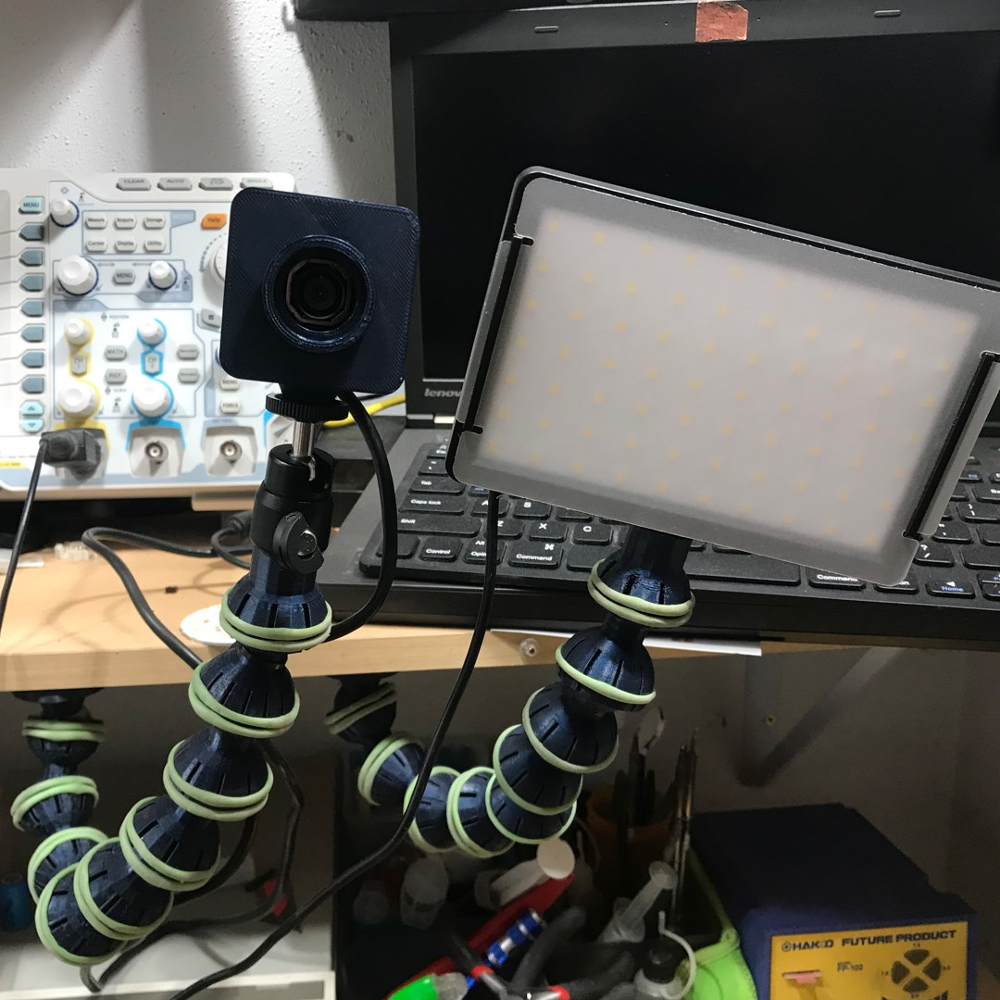

# Dingus-Generator

---
> Snap-together ball and socket camera mounting dingii

## Overview
OpenSCAD scripts to generate snap-together articulated ball and socket dinguses for repositionable mounting of small cameras, lights, and instruments.

  

## Usage

- **Dingus.scad**
	- Generates articulating ball and socket dingus segments
- **FlangeBase.scad**
	- Generates terminal dingus with flange mount and ball suitable for screwing or sticking to surfaces.
- **CamMount.scad**
	- Generates terminal dingus with socket to provide a 1/4-20 tripod mounting stud to mount stuff on.

Most parameters you need are exposed in the OpenSCAD customizer, modify them as you see fit to match your dingus requirements. I find keeping the radial resolution ($fn) fairly coarse helps with grip.

Don't expect these to support a DSLR, but they will hold webcams and cheap lights and I've had them deployed on my workbench in this capacity for around a year with no breakage.

Use castration bands (yes, really, the things used to nullify goats; a kit with the installation tool is less than $20) around the grooves to increase grippyness. Colophony dissolved in alcohol or liquid rosin-activated flux
applied to the ball and allowed to completely dry also will increase grip for holding slightly heavier apparatus.

I recommend printing these with the socket end up since they tend to detach from the build plate. The ball may be a bit misshapen when printed on support material but
this doesn't substantially affect performance.

PETG is about the only option here, PLA's brittleness and relatively poor layer adhesion makes the sockets too fragile to accept the ball. More exotic materials may be even better but I haven't tried any.

The default sizing for the camera mount terminal dingus will accept a piece of 1/4-20 threaded rod, and can be made oversize to fit a whole bolt.

## References
[OpenSCAD](https://openscad.org/)

## License

MIT